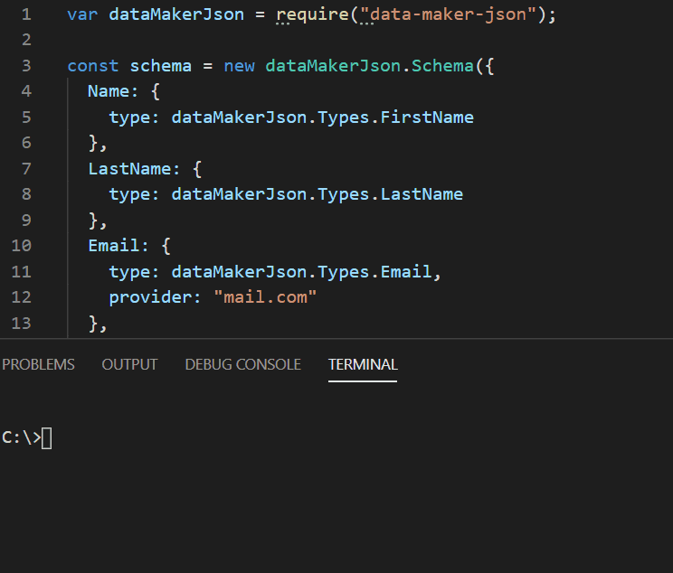

# data-maker-json
Genarte fake data.

#### Inatall via NPM:
    npm i data-maker-json
    
#### Usage:
###### Require dataMakerJson:  
    var dataMakerJson = require("data-maker-json");

###### Constract schema:
    const schema = new dataMakerJson.Schema({
        your-field-name: {
          type: dataMakerJson.Types.some-type,
          optional-setting: value,
        }
      });
###### Generate json object according to schema:
    schema.makeOne();
#### Example:

  

| Type  | optinal-setting |
| ------------- | ------------- |
| dataMakerJson.Types.FirstName  | None  |
| dataMakerJson.Types.LastName  | None  |
| dataMakerJson.Types.Email  | String: provider(Email provider default is gmail)  |
| dataMakerJson.Types.Password  | String: default(Default password, if not given a random 10 digit password will generated)  Boolean: toHash(If set to true uses bcrypt to hash the password)  |
| dataMakerJson.Types.Price  | Int: upperLimit(The random price upper limit, 100 is the default)  |
